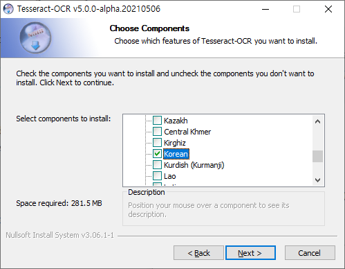

# Tesseract

이미지로부터 텍스트를 인식하고, 추출하는 소프트웨어를 일반적으로 OCR이라고 한다. Tesseract는 1984\~1994년에 HP 연구소에서 개발된 오픈 소스 OCR 엔진이며, 현재까지도 LSTM과 같은 딥러닝 방식을 통해 텍스트 인식률을 지속적으로 개선하고 있다.


## Tesseract 설치

Tesseract 프로그램을 설치하고 PowerShell이나 CMD 창에서 이미지를 인식하는 방법에 대해서 알아보자.

[Tesseract 사이트](https://github.com/tesseract-ocr/tessdoc)로 이동한다. 중간 쯤에 아래 이미지와 같은 링크가 보일 것이다. Windows 링크를 클릭한다.

.png>)

64 bit 링크를 클릭하여 설치한다. 

아래와 같이 PC 보호 화면이 표시된다. 추가정보 링크를 클릭하여 실행 버튼을 클릭한다.

.png>)

Next 버튼을 클릭한다. 

.png>)

Addtional Language Data에 Korean을 선택한다.



## Tessertact 환경 변수 등록

환경변수 PATH에 Tesseract 경로를 추가한다. 

.png>)

PowerShell을 열고 tesseract를 실행하여 확인한다.

.png>)

## OCR 이미지 텍스트 추출 테스트

### 커맨드 이용

### 사용방법

다음을 입력하여 사용법을 불 수 있다.

```shell
tesseract --help-extra
```

```shell
(ocr) PS F:\src\hyeon\latteonterrace\python\python-ocr\src\image_samples> tesseract --help-extra
Usage:
  C:\Program Files\Tesseract-OCR\tesseract.exe --help | --help-extra | --help-psm | --help-oem | --version
  C:\Program Files\Tesseract-OCR\tesseract.exe --list-langs [--tessdata-dir PATH]
  C:\Program Files\Tesseract-OCR\tesseract.exe --print-fonts-table [options...] [configfile...]
  C:\Program Files\Tesseract-OCR\tesseract.exe --print-parameters [options...] [configfile...]
  C:\Program Files\Tesseract-OCR\tesseract.exe imagename|imagelist|stdin outputbase|stdout [options...] [configfile...]

OCR options:
  --tessdata-dir PATH   Specify the location of tessdata path.
  --user-words PATH     Specify the location of user words file.
  --user-patterns PATH  Specify the location of user patterns file.
  --dpi VALUE           Specify DPI for input image.
  -l LANG[+LANG]        Specify language(s) used for OCR.
  -c VAR=VALUE          Set value for config variables.
                        Multiple -c arguments are allowed.
  --psm NUM             Specify page segmentation mode.
  --oem NUM             Specify OCR Engine mode.
NOTE: These options must occur before any configfile.

Page segmentation modes:
  0    Orientation and script detection (OSD) only.
  1    Automatic page segmentation with OSD.
  2    Automatic page segmentation, but no OSD, or OCR. (not implemented)
  3    Fully automatic page segmentation, but no OSD. (Default)
  4    Assume a single column of text of variable sizes.
  5    Assume a single uniform block of vertically aligned text.
  6    Assume a single uniform block of text.
  7    Treat the image as a single text line.
  8    Treat the image as a single word.
  9    Treat the image as a single word in a circle.
 10    Treat the image as a single character.
 11    Sparse text. Find as much text as possible in no particular order.
 12    Sparse text with OSD.
 13    Raw line. Treat the image as a single text line,
       bypassing hacks that are Tesseract-specific.

OCR Engine modes:
  0    Legacy engine only.
  1    Neural nets LSTM engine only.
  2    Legacy + LSTM engines.
  3    Default, based on what is available.

Single options:
  -h, --help            Show minimal help message.
  --help-extra          Show extra help for advanced users.
  --help-psm            Show page segmentation modes.
  --help-oem            Show OCR Engine modes.
  -v, --version         Show version information.
  --list-langs          List available languages for tesseract engine.
  --print-fonts-table   Print tesseract fonts table.
  --print-parameters    Print tesseract parameters.
```

이미지가 있는 폴더로 이동하여 커맨드라인에서 우선 추출해 본다.

#### 한글 추출

추출하려고하는 이미지의 글자가 한글이기 때문에 -ㅣ 옵션을 주어 한글을 인식하게 해야 한다.

```shell
tesseract kor_data1.png stdout -l kor+eng
```

완벽하지는 않지만 한글이 제법 잘 인식이 되는 결과가 아래와 같이 나온다. 영문이 있을 때 영문도 잘 인식을 하게 하려면 kor+eng 사용한다.

```shell
(ocr) PS F:\src\hyeon\latteonterrace\python\python-ocr\src\image_samples> tesseract kor_data1.png stdout -l kor+eng
인기 HE 원작 드라마로 제작 확정 때부터 기대를 QOS <모범택시). 이제는 AMES 화제를 모으고 있다. (5
월 6일 기준 최고 시청률 17.6%) 간단히 말하면 <모범택시 = 무지개 운수가 그들만의 방법으로 영업하는 이야
기다. 택시기사, 경리, 엔지니어. 그럴듯한 구성원과 시설을 갖춘 이 운수 회사의 정체는 복수 대행업체. 무지개
기다. 택시기사, 경리, 엔지니어. 그럴듯한 구성원과 시설을 갖춘 이 운수 회사의 정체는 복수 대행업체. 무지개
운수는 법의 보흐를 받지 못하는 억울한 피해자들을 위해 복수를 대신하는 택시 회사다. 허름한 차고지 땅 아래
에는 AM) <빼트맨> 시리즈에서나 볼 법한 아지트가 있다. 한국 패치를 한 배트모빌과도 같은 '모범택시"를
타고 도시를 순회하며 이들의 방법으로 선을 집행한다.


상반기 화제작 <빈센조>의 바동을 받아 인기를 잇고 있는 (DHEA), 그 중심에는 소위 사기캐로 불리는 김도기
(이제훈)가 있다. 특수부대 출신의 그에게는 스물댓 명이 한 번에 달려들어도 ALS 체력과, 본래 성격과는 전
혀 다른 능청스러움을 연기하는 재치도 있다. 김도기가 만능캐로 그려질 수 있는 데에는, HS 깔아주는 무지개
운수 직원들의 덕이 있다. 덤 앤 더머 못지않은 최&박 주임을 비롯해, 주축이 되는 캐릭터 결에서 극을 탄탄하게
```

계속 하다보면 느끼게 될 테지만 2개 이상의 언어를 추출하기 보다는 하나의 언어만 추출하는것이 더 좋은 결과를 가져오는 결과들을 볼 수 있다. 선택은 테스트 해보면서 해야할 것이다.

_**psm 옵션**_\
이번에는 사용법에 나와 있는 psm 옵션을 주면서 내가 가진 이미지 속에 텍스트를 어떤 방식으로 추출할 지 결정하면 된다.

```shell
tesseract kor_data1.png stdout -l kor+eng --psm 4
```

psm은 0부터 13까지 정수값 중에 하나를 선택하면 된다.

그리고 oem 옵션도 지정할 수 있다.

초반에 테서렉트 4부터는 LSTM 기반 OCR 엔진이 추가되었다고 했었는데 0부터 3까지 선택을 하면 된다.

이 때 LSTM 기반 엔진을 사용하려면 LSTM 모델을 업데이트한 언어 데이터를 다운 받아야 한다. 테서렉트를 설치하면서 받은 언어데이터에는 기본 데이터만 들어 있는 것으로 보여진다. 이 데이터로 LSTM 엔진을 사용하려고 하면 아래와 같은 에러가 발생한다.

이 문제를 해결하기 위해서 언어데이터를 https://github.com/tesseract-ocr/에서 다운로드 한다.

링크를 들어가면 위와 같이 LSTM 모델 데이터를 제공하고 있으며 kor 언어데이터를 다운로드받아 이름이 중복되지 않게 변경한 후 처음에 언급했던 저장 위치에 (Tesseract-OCR\tessdata) 저장하면 된다.

.png>)

그 후 저장한 언어데이터명으로 변경하고 oem 값으로 1 또는 2를 입력하며 실행하면 다음과 같은 결과를 얻을 수 있다.

LSTM 모델로 학습한 언어데이터를 쓰는게 반드시 좋은 결과를 가져다 주는 것은 아니지만 이렇게도 사용할 수 있다.

```shell
tesseract kor_data1.png stdout -l kor --psm 4 --oem 2
```

#### 영문 추출

.png>)

## Python에서 Tesseract 사용하기 (pytesseract)

https://niceman.tistory.com/157?category=1009824

python에서 Tesseract를 사용하기 위해서는 pytesseract와 pillow를 설치해야 한다. cmd창에서 pip로 설치를 한다.

```shell
pip install pillow
pip install pytesseract
```

설치가 끝나면 아래와 같은 코드를 통해 실행할 수 있다.

```python
from PIL import Image
from pytesseract import *

filename = "D:/Data/ocr/sample.jpg"
image = Image.open(filename)
text = image_to_string(image, lang="kor")

with open("sample.txt", "w") as f:
    f.write(text)
```

## 관련 지식

#### 버전별 차이점

예전에 tesseract 썼을 때는 인식률 너무 안좋아서 다른 걸 사용했었는데 구글 입김 들어가고 개선된 5.0 버전 사용하니 인식률이 좋다.

* 3.0 버전은 전통적인 cv 알고리즘을 이용한다. 따라서 문맥을 인지하지 못한다.
* 4.0 버전부터 딥러닝 모델(lstm)이 들어감

가장 최근에 나온 버전이 5.0 인데 가장 최신 버전을 받는게 제일 좋은 것 같다.

### Java에서 사용

pom.xml에 의존성을 추가한다.

```xml
<dependency>
    <groupId>net.sourceforge.tess4j</groupId>
    <artifactId>tess4j</artifactId>
    <version>4.5.2</version>
</dependency>
```

```java
Tesseract tesseract = new Tesseract();
tesseract.setLanguage("deu");
tesseract.setOcrEngineMode(1);
 
Path dataDirectory = Paths.get(ClassLoader.getSystemResource("data").toURI());
tesseract.setDatapath(dataDirectory.toString());
 
BufferedImage image = ImageIO.read(Main.class.getResourceAsStream("/ocrexample.jpg"));
String result = tesseract.doOCR(image);
System.out.println(result);
```

* 자세한 사용방법은 [여기](https://www.javacodegeeks.com/2020/08/ocr-in-java-with-tess4j.html)를 참조한다.
* 한글 깨짐 현상은 [여기](https://developer-youn.tistory.com/4)를 참조한다.

## 한글 학습시키기

자세한 사항은 [여기](https://diyworld.tistory.com/114)를 참고한다. [여기도](https://swlock.blogspot.com/2016/08/ocr-tesseract-3.html) 참고한다.

### python에서 학습시키기

[여기](https://gimongstudy.tistory.com/19)를 참고한다. [여기도](https://junyoung-jamong.github.io/computer/vision,/ocr/2019/01/30/Python%EC%97%90%EC%84%9C-Tesseract%EB%A5%BC-%EC%9D%B4%EC%9A%A9%ED%95%B4-OCR-%EC%88%98%ED%96%89%ED%95%98%EA%B8%B0.html) 참고한다.

[**여기**](https://nanonets.com/blog/ocr-with-tesseract/)**가 영문 사이트인데 학습에 관해 자세히 설명이 되어 있다.**

## References

[사용방법](https://joyhong.tistory.com/79)
